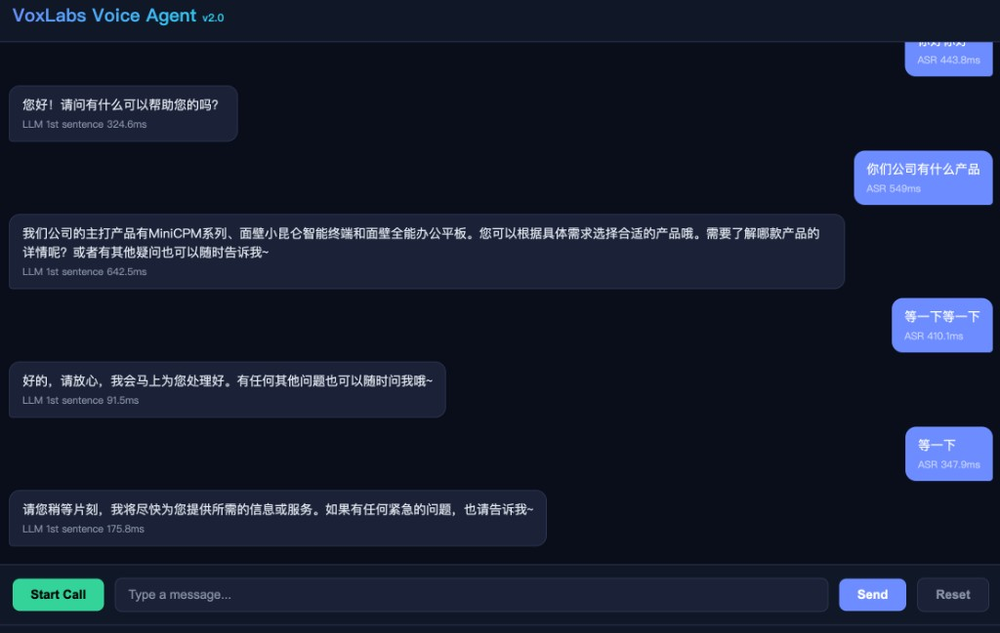

<h1 align="center">
  <br>
  VoxLabs — Full-Duplex Voice Agent
  <br>
</h1>

<h4 align="center">Real-time Chinese voice agent with sub-500ms response, streaming barge-in, and voice cloning.<br>Built for BPO & call-center scenarios.</h4>

<p align="center">
  
  
  
  
</p>

<p align="center">
  
</p>

---

## Architecture Overview

```
┌─────────────────────────────────────────────────────────────────────────────┐
│  Browser                                                                    │
│  Mic → PCM 16kHz → WebSocket → Server                                      │
│  Speaker ← PCM 44.1kHz ← WebSocket (turn-filtered) ← Server               │
│  Client: instant stopPlayback() + turn sequence number filtering            │
└──────────────────────────────┬──────────────────────────────────────────────┘
                               │ WSS (Cloudflare Tunnel / direct)
                               ▼
┌─────────────────────────────────────────────────────────────────────────────┐
│  ConversationManager v2.4 — 5-State Machine                                │
│  IDLE → LISTENING → THINKING → SPEAKING → INTERRUPTED                      │
│                                                                             │
│  ┌──────┐  ┌──────────┐  ┌───────┐  ┌─────┐  ┌─────────┐  ┌────────────┐ │
│  │ VAD  │  │Smart Turn│  │  ASR  │  │ RAG │  │   LLM   │  │ TTS Stream │ │
│  │Silero│→ │Pipecat v3│→ │FireRed│→ │ bge │→ │MiniCPM4 │→ │  VoxCPM    │ │
│  │ CPU  │  │ 8M ONNX  │  │ASR2   │  │FAISS│  │  vLLM   │  │  nanovllm  │ │
│  └──────┘  └──────────┘  └───────┘  └─────┘  └─────────┘  └────────────┘ │
│                                                     ↑ cancel per chunk     │
│  Optional: ECAPA-TDNN speaker VAD │ Moonshine speculative ASR │ DTLN      │
└─────────────────────────────────────────────────────────────────────────────┘
```

---

## Key Features

<table>
<tr>
<td width="50%">

### Streaming Barge-in (v2.4)
TTS generates audio **chunk by chunk** (~160ms each). Cancel is checked between every chunk — max 160ms residual on interrupt. Previous versions sent entire sentences at once (3-5s uninterruptible).

### Noise-Robust ASR
**FireRedASR2-AED** (CER 2.89%, 1.15B params) trained on diverse noisy environments. Supports 20+ Chinese dialects including Cantonese.

### Semantic Endpointing
**Pipecat Smart Turn v3** (8M ONNX, 0.7ms CPU) analyzes audio prosody to detect turn completion. Replaces fixed silence thresholds.

</td>
<td width="50%">

### Voice Cloning
8-second reference audio → cloned voice via VoxCPM 1.5. Used across all TTS output.

### Speculative ASR
**Moonshine Tiny** (27M, ONNX CPU) starts transcribing during silence before endpointing confirms. If audio hasn't changed, result is reused — saving ~117ms.

### RAG Knowledge Base
bge-small-zh-v1.5 + FAISS, hot-reload via `POST /api/rag/reload`. 59 FAQ items, 3.6ms retrieval.

</td>
</tr>
</table>

---

## Performance

<table align="center">
<tr><th>Component</th><th>Model</th><th>Latency</th><th>Note</th></tr>
<tr><td><b>ASR</b></td><td>FireRedASR2-AED (1.15B)</td><td><b>~200ms</b></td><td>CER 2.89%, 20+ dialects</td></tr>
<tr><td><b>RAG</b></td><td>bge-small-zh + FAISS</td><td><b>3.6ms</b></td><td>59 docs, hot-reload</td></tr>
<tr><td><b>LLM</b></td><td>MiniCPM4.1-8B-GPTQ</td><td><b>~163ms</b></td><td>vLLM, sentence streaming</td></tr>
<tr><td><b>TTS</b></td><td>VoxCPM 1.5 streaming</td><td><b>~174ms</b></td><td>Per-chunk cancel</td></tr>
<tr><td><b>Pipeline</b></td><td>—</td><td><b>~458ms</b></td><td>Target &lt; 500ms ✅</td></tr>
</table>

### Barge-in: Before vs After

```
v2.3 — Batch TTS (entire sentence pushed at once):
  User: "停!" → barge_in sent → but 3 seconds of audio already in TCP pipe
  Result: AI keeps talking for 2-3 more seconds ❌

v2.4 — Streaming TTS (chunk-by-chunk with cancel check):
  User: "停!" → VAD detects (64ms) → cancel_speaking → TTS stops at next chunk
  Result: max 160ms of residual audio, then silence ✅
```

---

## Three Architecture Comparison

<table align="center">
<tr><th></th><th>Pipeline (this project)</th><th><a href="https://github.com/HenryZ838978/Hybrid-VoiceAgent">Hybrid</a></th><th>Pure Omni</th></tr>
<tr><td>First Audio</td><td>458ms ✅</td><td><b>~250ms ✅✅</b></td><td>1666ms ❌</td></tr>
<tr><td>Barge-in</td><td><b>160ms (streaming TTS)</b></td><td>160ms</td><td>Native</td></tr>
<tr><td>Noise Robust</td><td><b>FireRedASR2 2.89%</b></td><td>Whisper-medium</td><td>Built-in</td></tr>
<tr><td>Swap ASR/LLM/TTS</td><td><b>Replace one module</b></td><td>Locked</td><td>Locked</td></tr>
<tr><td>Custom voice</td><td><b>Clone in hours</b></td><td>Clone in hours</td><td>Retrain model</td></tr>
<tr><td>LLM fine-tune</td><td><b>SFT ~$20</b></td><td>Omni SFT</td><td>~$5000+</td></tr>
</table>

---

## Quick Start

```bash
# 1. Start vLLM (GPU 1)
CUDA_VISIBLE_DEVICES=1 python -m vllm.entrypoints.openai.api_server \
  --model models/MiniCPM4.1-8B-GPTQ --served-model-name MiniCPM4.1-8B-GPTQ \
  --trust-remote-code --dtype auto --quantization gptq_marlin \
  --gpu-memory-utilization 0.40 --max-model-len 2048 --enforce-eager --port 8100

# 2. Start Voice Agent (GPU 2) — recommended config
CUDA_VISIBLE_DEVICES=2 ASR_DEVICE=cuda:0 TTS_DEVICE=cuda:0 \
  USE_FIRERED_ASR=1 USE_MOONSHINE_ASR=1 USE_SMART_TURN=1 \
  python ws_server.py

# 3. Open browser → https://localhost:3000 → Start Call
```

### Environment Toggles

| Variable | Default | Description |
|---|---|---|
| `USE_FIRERED_ASR=1` | off | FireRedASR2-AED (CER 2.89%, noise-robust) |
| `USE_MOONSHINE_ASR=1` | off | Moonshine Tiny speculative ASR (27M, CPU) |
| `USE_SMART_TURN=1` | off | Pipecat Smart Turn v3 semantic endpointing |
| `USE_SPEAKER_VAD=1` | off | ECAPA-TDNN speaker-aware VAD |
| `USE_DENOISE=1` | off | DTLN denoiser (4MB ONNX) |
| `TTS_GPU_UTIL` | 0.55 | TTS GPU memory fraction |

### LiveKit WebRTC (Experimental)

```bash
# Native WebRTC transport — zero TCP in-flight frame issue
./livekit-server --config livekit.yaml --dev
python livekit_agent/run.py dev
```

---

## API

| Endpoint | Method | Description |
|---|---|---|
| `/` | GET | Voice Agent Console |
| `/ws/voice` | WS | Full-duplex voice channel |
| `/api/info` | GET | Model info & config |
| `/api/rag/docs` | GET | Knowledge base documents |
| `/api/rag/query?q=` | GET | Test RAG retrieval |
| `/api/rag/reload` | POST | Hot-reload knowledge base |

---

## Project Structure

```
voiceagent/
├── engine/                       # ML engines (all swappable)
│   ├── asr.py                    #   SenseVoiceSmall (fallback)
│   ├── asr_firered.py            #   FireRedASR2-AED (recommended)
│   ├── asr_moonshine.py          #   Moonshine Tiny (speculative)
│   ├── llm.py                    #   vLLM streaming
│   ├── tts.py                    #   VoxCPM 1.5 streaming
│   ├── vad.py / speaker_vad.py   #   Silero / ECAPA-TDNN
│   ├── turn_detector.py          #   Pipecat Smart Turn v3
│   ├── rag.py                    #   bge-small + FAISS
│   ├── captioner.py              #   Paralinguistic awareness
│   ├── denoiser.py               #   DTLN (optional)
│   └── conversation_manager.py   #   v2.4 state machine
│
├── livekit_agent/                # WebRTC agent (experimental)
├── static/voice_agent.html       # WebSocket frontend
├── ws_server.py                  # FastAPI server
└── config.py                     # Model paths & prompts
```

---

## Version History

| Version | Highlights |
|---|---|
| v1.0 | Basic full-duplex, serial pipeline, voice cloning |
| v2.0 | State machine, sentence streaming, zero-pop audio |
| v2.1 | Dual-layer barge-in, adaptive endpointing |
| v2.2 | Speculative ASR, speaker VAD, paralinguistic awareness |
| v2.3 | Moonshine, Smart Turn, FireRedVAD, jitter buffer |
| **v2.4** | **FireRedASR2, streaming TTS barge-in, event loop fix, LiveKit** |
